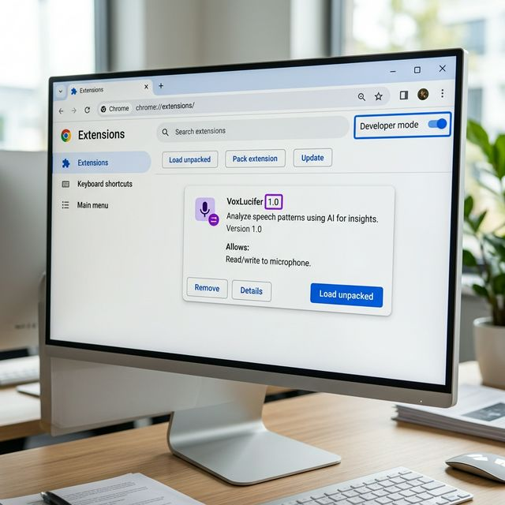
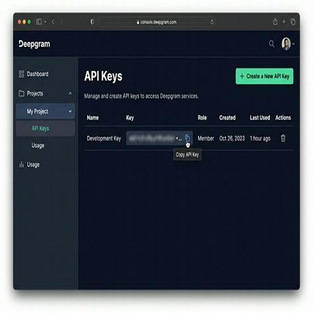
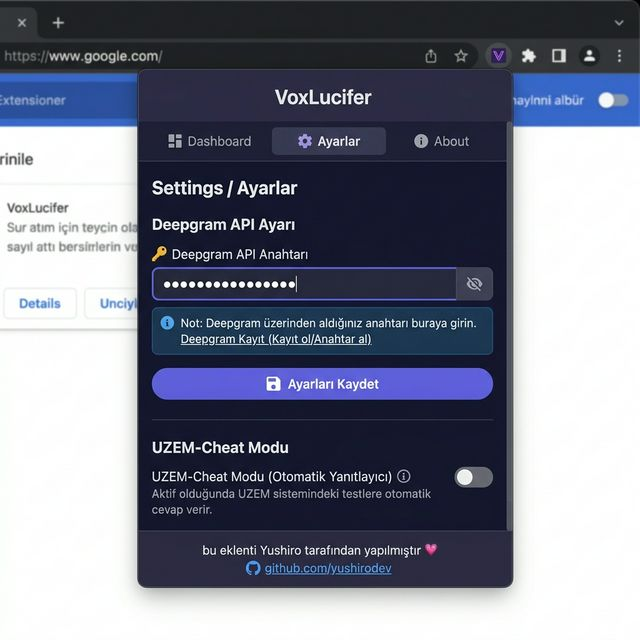
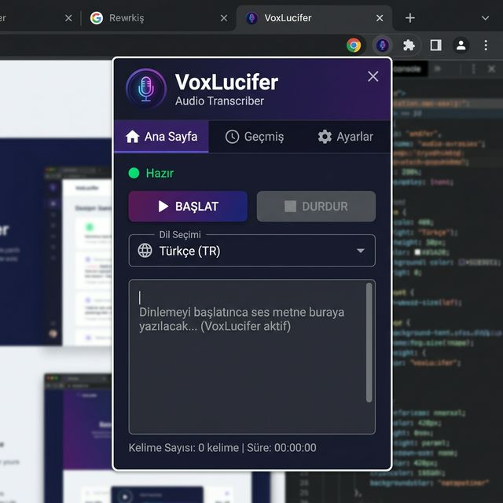

# 🎙️ VoxLucifer — Sesli İçerik Transkripsiyon Eklentisi

> **Tarayıcıdaki video ve ses içeriklerini gerçek zamanlı olarak metne dönüştürün.**  
> Deepgram Nova-2 ile desteklenir. Ücretsiz, hızlı ve özel.

---

## ✨ Özellikler

| Özellik | Açıklama |
|---|---|
| 🎙️ **Canlı Transkripsiyon** | Sekmeden gelen sesi anlık olarak metne çevirir |
| 🖱️ **Sağ Tık ile Başlat** | Herhangi bir video/ses sayfasında sağ tık → Başlat |
| 📋 **Otomatik Kopyalama** | Kayıt bitince metin panoya otomatik kopyalanır |
| 📚 **Oturum Geçmişi** | Son 50 oturum kaydedilir, dilediğinizde görüntüleyin |
| 🌍 **Çoklu Dil** | Türkçe, İngilizce, Almanca, Arapça, Fransızca |
| 🛡️ **UZEM-Cheat Modu** | Hedef sitelerdeki kopyala/yapıştır ve sağ tık engelini kaldırır |
| 🪟 **Pop-out Pencere** | Eklentiyi bağımsız yüzer pencerede kullanın |
| 🎨 **Dinamik İkon** | Kayıt sırasında eklenti ikonu değişir |

---

## 📦 Kurulum (Developer Mode)

### Gereksinimler
- Google Chrome (v114+) veya Chromium tabanlı bir tarayıcı
- Ücretsiz [Deepgram](https://console.deepgram.com/signup) hesabı (200 saat/ay ücretsiz)

---

### Adım 1 — Dosyaları İndirin

1. Bu repoyu ZIP olarak indirin:  
   **Code → Download ZIP** butonuna tıklayın
2. ZIP'i bir klasöre çıkarın (örnek: `C:\VoxLucifer`)

---

### Adım 2 — Chrome'da Developer Mode Açın

1. Chrome'da yeni sekme açın ve adres çubuğuna yazın:
   ```
   chrome://extensions/
   ```
2. Sağ üst köşedeki **"Developer mode"** (Geliştirici modu) anahtarını **açık** konuma getirin



---

### Adım 3 — Eklentiyi Yükleyin

1. Sol üstte beliren **"Load unpacked"** (Paketlenmemişi yükle) butonuna tıklayın
2. ZIP'i çıkardığınız **klasörü** seçin (içinde `manifest.json` olan klasör)
3. VoxLucifer eklenti listesine eklenir ✅

> ⚠️ **Not:** Klasörü silmeyin! Chrome her açılışta o konumdan yükler.

---

### Adım 4 — Deepgram API Anahtarı Alın

1. [console.deepgram.com](https://console.deepgram.com/signup) adresine gidin ve ücretsiz hesap oluşturun
2. Sol menüden **API Keys** sekmesine tıklayın
3. **"Create a New API Key"** butonuna basın, bir isim verin ve oluşturun
4. Çıkan anahtarı kopyalayın (bir daha gösterilmez!)



---

### Adım 5 — API Anahtarını Eklentiye Girin

1. Chrome araç çubuğunda 🎙️ **VoxLucifer** simgesine tıklayın
2. **⚙️ Ayarlar** sekmesine geçin
3. **"🔑 Deepgram API Anahtarı"** alanına kopyaladığınız anahtarı yapıştırın
4. **"💾 Ayarları Kaydet"** butonuna tıklayın



---

## 🚀 Kullanım

### Yöntem 1 — Eklenti Popup'ından

1. Video/ses oynatan sekmeye gidin
2. 🎙️ VoxLucifer simgesine tıklayın
3. İstediğiniz dili seçin
4. **▶ Başlat** butonuna basın
5. Transkript anlık olarak kutuya yazılır
6. **⏹ Durdur** ile kaydı sonlandırın — metin otomatik panoya kopyalanır



---

### Yöntem 2 — Sağ Tık Menüsü (Önerilen)

1. Video/ses içeriği olan herhangi bir sayfada **sağ tıklayın**
2. **"VoxLucifer ile Dinlemeyi Başlat"** seçeneğine tıklayın
3. Kayıt başlar, eklenti ikonu kırmızıya döner 🔴
4. Durdurmak için tekrar sağ tık → **"VoxLucifer Dinlemeyi Durdur"**

---

### Yöntem 3 — Pop-out Pencere

- Popup'taki **↗️** butonuna tıklayarak eklentiyi bağımsız yüzer pencerede açın
- Video oynarken yan yana kullanın

---

## 🛡️ UZEM-Cheat Modu

Moodle/UZEM gibi bazı eğitim platformları metni seçmeyi, kopyalamayı ve sağ tıklamayı engeller. Bu mod aktif edildiğinde:

- ✅ Sağ tık engeli kaldırılır
- ✅ Ctrl+C / Ctrl+V kısıtlaması aşılır
- ✅ Metin seçme kilidi açılır
- ✅ `alert()` tabanlı "Bu özellik devre dışı" uyarıları susturulur
- ✅ Kısıtlı pop-up sınav pencereleri normal sekmeye taşınır

**Nasıl Açılır:**
1. ⚙️ Ayarlar → **"UZEM-Cheat Modu"** toggle'ını açın
2. **Hedef Siteler** listesine sitenin domain'ini ekleyin  
   (örnek: `uzak.mehmetakif.edu.tr`)
3. Sayfayı yenileyin — mod aktif!

> 🔑 **Kısayol:** Hedef sitede `Alt + Shift + V` ile pop-out pencereyi açabilirsiniz.

---

## 📚 Oturum Geçmişi

- **Geçmiş** sekmesinde son 50 oturum listelenir
- Her oturumda: başlık, tarih/saat, kelime sayısı ve önizleme gösterilir
- 📋 butonu ile istediğiniz oturumu panoya kopyalayın
- Bir oturuma tıklayarak transkripti ana ekrana yükleyin

---

## 🔧 Sorun Giderme

| Sorun | Çözüm |
|---|---|
| "Bu sayfa yakalanamaz" hatası | Chrome:// sayfalarında çalışmaz. Video içeren bir siteye gidin |
| Ses gelmiyor / Transkript boş | API anahtarınızı kontrol edin. Deepgram konsolundan krediyi doğrulayın |
| Eklenti yüklenmedi | `manifest.json` olan klasörü seçtiğinizden emin olun |
| Sağ tık menüsü görünmüyor | Eklentiyi yeniden yükleyin: `chrome://extensions/` → Yenile butonu |
| Dil yanlış | Popup'ta dil seçiciden doğru dili seçin |

---

## 🏗️ Teknik Mimari

```
VoxLucifer/
├── manifest.json         ← Eklenti tanımı, izinler
├── background.js         ← Service Worker: tabCapture, geçmiş, mesajlaşma
├── content.js            ← Sayfa enjeksiyonu: cheat bypass
├── inject.js             ← Alert/dialog engelleyici (doğrudan sayfaya)
├── offscreen/
│   ├── offscreen.html    ← Offscreen document kapsayıcısı
│   ├── offscreen.js      ← Deepgram WebSocket + AudioWorklet
│   └── audio-processor.js ← AudioWorklet: Float32 → PCM16
├── popup/
│   ├── popup.html        ← Arayüz
│   ├── popup.js          ← Mantık: başlat/durdur/geçmiş/ayarlar
│   └── popup.css         ← Stil
└── icons/                ← Normal ve kayıt ikonu setleri
```

**Ses akışı:**
```
Chrome Sekme → tabCapture → getUserMedia (offscreen)
  → AudioContext → AudioWorklet (PCM16)
    → Deepgram WebSocket → Transkript → Popup / Geçmiş
```

---

## 📄 Lisans

MIT License — Özgürce kullanın, dağıtın, değiştirin.

---

<div align="center">

**bu eklenti [Yushiro](https://github.com/salihelsalih) tarafından yapılmıştır ❤️**

</div>
